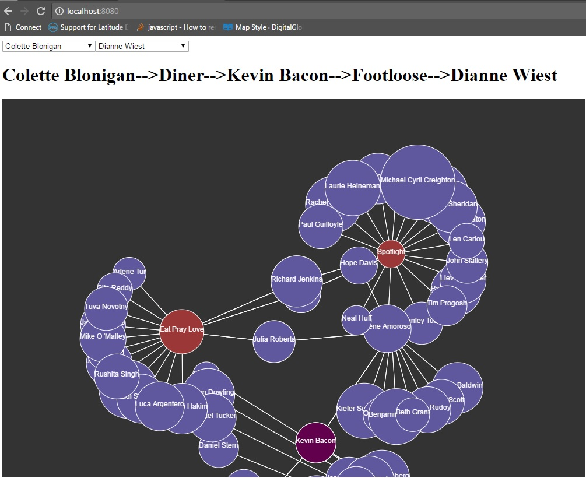

#Six degrees of Bacon game using breadth first search and also visualisation to better understand the data.

shout-out to the guys who run Oracleofbacon.com and Daniel Sheffman from CodingTrain.

Steps:

1. Install NodeJs
2. Move to the folder where you have downloaded this repo.
3. Run "npm http-server"
4. You should be able to see the visual representation in http://localhost:8080

